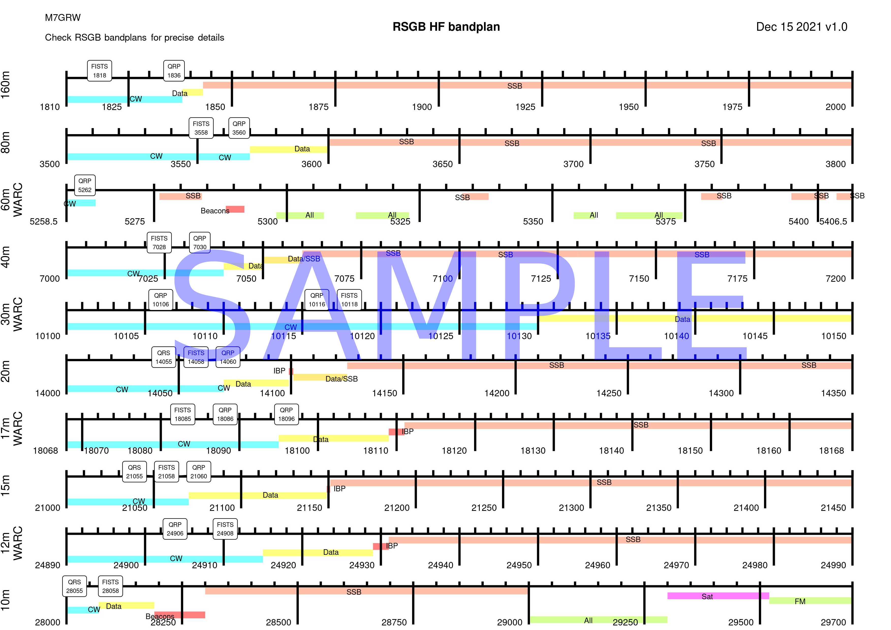

# Bandplan Plotter

A collection of R based scripts that take a set of CSV and markdown data files and turn them
into a frequency bandplan diagram.

The primary intention was to generate a bandplan diagram for
[RSGB bandplans](https://rsgb.org/main/operating/band-plans/) for my desk(shack). As the scripts are
data driven it should be fairly trivial to use to generate other bandplans by adding additional
data sets.



>  Note: If you want to get prebuilt jpg's and pdf's then look at the [Releases](FIXME) page.

## Overview

The scripts are written primarily in [`R`](https://www.r-project.org/about.html), mostly as I
already knew `R` somewhat, and it has a reasonably nice and adaptable graphing library -
[`ggplot`](https://ggplot2.tidyverse.org/index.html).

Although it may have been fairly easy to draw out a bandplan in a diagramming package, like
LibreOffice or similar, I really wanted to make this data driven code for a couple of reasons:

- There will be mistakes, and mofidying the data and re-running the scripts is easier than editing
  an image in a gui tool
- It makes it fairly trivial to add more bandplan datasets

## Building

The build system is based on running `R` under [Docker](https://www.docker.com/). This is simply
as it is easier for me to put together a local docker image that contains all the R bits needed
rather than trying to get them all installed natively on my machine.

If you don't have or use docker, but do use R, then it should not be too hard to work out how
to run the scripts under R directly. It may be worth looking at the [Dockerfile](dockerfile/Dockerfile)
to see what R packages are used.

### Build the docker image

First, you need to build the docker image:

```bash
$ ./dockerbuild.sh
```

This takes a short while whilst it collects up all the relevant R parts into the image. Some are
compiled from source.

Once completed your local docker image store should contain an image called `bandplan_plotter`

### Doing a build

To do a 'build' of the default datasets, run the script that runs the docker image:

```bash
$ ./dockerrun.sh
```

This should produce some jpg files in your local directory, such as 
`rsgb_hf.jpg` and `rsgb_uvhf.jpg`. These files should be useable directly, or you can combine
them into a single pdf by following the next step.

### Building a pdf

The jpg files can be combined into a single pdf file for convinience by running the simple script:

```bash
$ ./makepdf.sh
```

This should produce the `allbands.pdf` file.

## Releases

Pre-built files can be found in the [Releases](FIXME) section.

## Adding more datasets

The general idea is that it should be easy to add new datasets to generate new bandplans to this
project. Each bandplan dataset lives in its own subdirectory.

If you want to generate a new bandplan then I'd generally recommend copying an existing bandplan
dataset subdirectory, and then modifying it. Each dataset contains the following files:

#### `bands.csv`

The `bands.csv` file defines the frequency ranges the bandplan is going to cover. The only
non-mandatory field is the `notes` field. If you add a notes field entry then it will be added
to the bandplan `name` field as part of the y-axis label.

#### `zones.csv`

The `zones.csv` file consists of definitions for each 'sub section' of each band. It is effectively
a collection of sets of data, one per band as defined in the `bands.csv` file.

If an entry in the `zones.csv` file has a frequency that falls within one of the `bands.csv` file
entries then it will be included and drawn within that band.

The `type` field in the zones is used to both annotate the zone on the bandplan as well as locate
which colour to draw the zone in - see the next section.

#### `colours.csv`

The `colours.csv` file defines which colour to draw each zone entry in. It is fairly mandatory to
have one colour entry to match each type of zone. If you don't then the zone will be drawn in some
default colour (probably grey).

> Note: One day I'll probably 'rotate' the colours.csv file so it is just two columns, rather than the
current two rows, purely as editing the long rows as it stands is a bit of a pain.

#### `tags.csv`

The `tags.csv` contains a list of items to be 'annotated' onto the bandplans. This can be a useful
feature to highlight specific frequencies.

At present only the `start_freq` field defines where the tag is placed. Later support could be added
to tag 'ranges', at which point we'd figure out how to draw them nicely on the bandplan.

#### `title.md`

The `title.md` file contains [markdown](https://en.wikipedia.org/wiki/Markdown) text to be drawn
at the top of the bandplan plot. It is rendered using a
[`geom_richtext`](https://cran.r-project.org/web/packages/ggtext/vignettes/plotting_text.html)
library. Be aware that not all markdown or html types may be supported and rendered, and changing
the rendering of the title text may affect the size and position of the other text in the titlebar.

#### `README.md`

Please do update the `README.md` file for each data subdirectory to describe what the bandplan
data is trying to describe.

## Debug and development

If you want to modify the `plot.R` code and experiment etc. then the `dockershell.sh` utility
script can be used to enter into a running docker image that is then useful for `R` development
and debugging. The basic use case is something like:

```bash
$ ./dockershell.sh
# R
> source('/data/plot.R')
^D
exit
```

To build a specific dataset, at the R prompt set the `inputdir` variable to the name of the
relevant directory:

```R
> inputdir="rsgb_uvhf"
> source('/data/plot.R')
```

## Contributing

If you want to contribute by sending bug reports, addtions, fixes or new datasets then the best
way is by using the github Issues or pull request methods. If you are flummoxed by that then feel
free to try emailing me.

## Re-using

This code base is under the Creative Commons [CC-BY](https://creativecommons.org/licenses/by/4.0/)
license. Basically, you can use it as you wish, but please do attribute where you got the original
code from. Thanks.

## Credits

In part the idea to render a bandplan was driven by my personal need, but inspired by a couple of
existing bandplan charts:

- [FISTS](https://fists.co.uk/) supply a [bandplan](https://fists.co.uk/frequencies.html) giving
  both their and the general QRP CW frequencies annotated on a chart. I have this on my desk, it's
  great - but, sometimes I want to wander up the band into the SSB area to check activity and
  propogation, but the FISTS chart only covers the CW sections. Thus, I wanted an 'expanded' chart.
- [S56G](https://www.s56g.net/) supplies some really nice
  [bandplans](https://www.s56g.net/index.php/s5-bandplans/) covering IARU Region 1, but they don't
  really represent the UK RSGB plans, so I pretty much wanted to re-create something similar but
  more appropriate to me.

